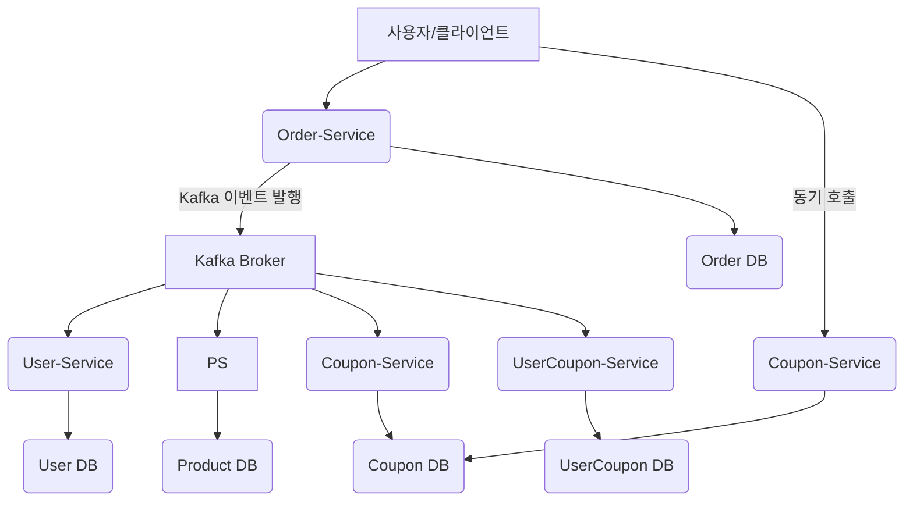
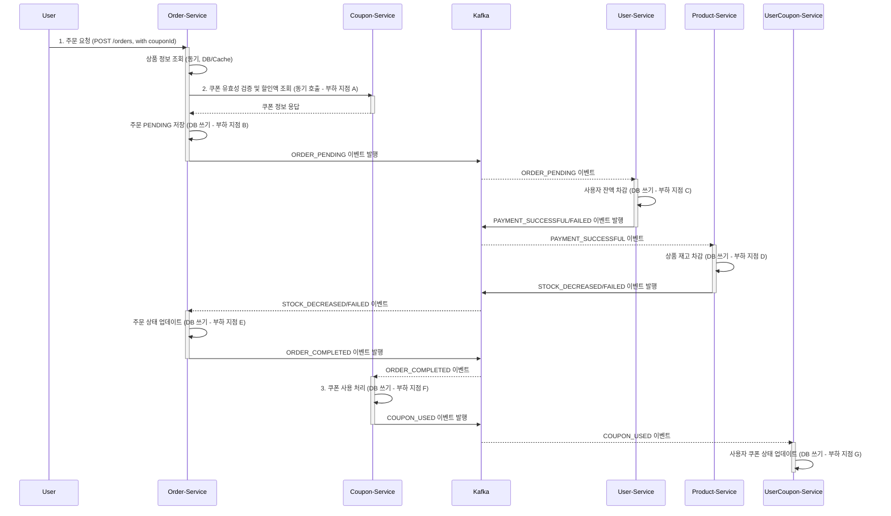

### 1. 시스템 아키텍처 및 부하 지점 시각화

#### 1.1. 프로젝트 마이크로서비스 구조

#### 1.2. 주문 처리 Saga 흐름 및 부하 발생 지점

---

### 2. 부하 테스트 대상 선정 및 목적

#### 2.1. 부하 테스트 대상 서비스 및 엔드포인트
*   **주요 대상:** `order-service`의 주문 생성 API (예: `POST /api/v1/orders`)
*   **연관 대상 (간접 영향 분석):** `user-service` (잔액 차감), `product-service` (재고 차감), `usercoupon-service` (사용자 쿠폰 상태 업데이트), Kafka 클러스터, 데이터베이스

#### 2.2. 대상 선정 이유
최근 주문 시스템에 Saga 패턴을 도입하여 Kafka를 통한 비동기 분산 트랜잭션으로 전환하였습니다. 이 변경의 핵심은 `order-service`가 사용자 요청을 받아 주문을 시작하고, 이후의 결제 및 재고 차감은 비동기 이벤트로 처리하는 방식입니다.

*   **사용자 경험의 핵심:** `order-service`의 주문 생성 API는 사용자가 직접 상호작용하는 가장 중요한 비즈니스 로직입니다. 이 API의 응답 속도와 안정성은 사용자 만족도에 직결됩니다.
*   **분산 트랜잭션의 시작점:** `order-service`는 Saga 패턴의 오케스트레이터 역할을 수행하며, 모든 분산 트랜잭션의 시작점입니다. 이 초기 동기 호출의 성능과, 이후 Outbox 패턴을 통한 이벤트 발행 메커니즘의 안정성을 검증해야 합니다.
*   **잠재적 병목 지점:** `order-service`는 사용자 요청을 직접 처리하며, 내부적으로 DB 쓰기(주문, 주문 항목, Outbox 이벤트)를 수행합니다. 또한, `product-service` 및 `coupon-service`와의 동기 통신(상품/쿠폰 정보 조회 및 가격/할인 확인)도 포함되어 있어, 부하 시 병목 지점이 될 가능성이 높습니다.
*   **하위 서비스 영향 분석:** `order-service`에서 발행하는 `ORDER_PENDING` 이벤트는 `user-service` (결제)와 `product-service` (재고 차감)로 전달됩니다. `order-service`의 부하가 Kafka Consumer Lag 증가 등 전체 시스템의 비동기 처리 지연에 미치는 영향을 파악해야 합니다. 추가적으로, 주문 완료 후 발생하는 쿠폰 사용 처리(`coupon-service`, `usercoupon-service`) 과정도 전체 시스템의 부하에 기여하므로 함께 고려해야 합니다.

#### 2.3. 부하 테스트 목적
*   `order-service`의 주문 생성 API가 예상되는 최대 동시 사용자 수 및 트랜잭션 처리량(TPS)을 안정적으로 감당할 수 있는지 확인.
*   부하 상황에서 `order-service`의 응답 시간, 에러율, 자원 사용량(CPU, Memory, DB Connection) 측정.
*   Saga 패턴을 통한 비동기 이벤트 처리(Kafka 메시지 발행 및 하위 서비스의 이벤트 소비)가 부하 상황에서 지연 없이 원활하게 동작하는지 검증.
*   잠재적인 성능 병목 지점(DB, Kafka, 네트워크 등)을 식별하고 개선 방안 도출.
*   시스템의 최대 처리량(Throughput) 및 임계점(Breaking Point) 파악.
*   쿠폰 유효성 검증 및 사용 처리(`coupon-service`, `usercoupon-service`) 과정이 주문 처리 부하에 미치는 영향 분석.

### 3. 부하 테스트 진행 방법

#### 3.1. 테스트 시나리오: 동시 주문 생성
*   **시나리오 명:** 동시 주문 생성 및 비동기 처리 검증 (쿠폰 사용 포함)
*   **사용자 행동 시뮬레이션:**
    1.  다수의 가상 사용자가 `order-service`의 주문 생성 API (예: `POST /api/v1/orders`, 쿠폰 ID 포함)에 동시 다발적으로 주문 요청을 보냅니다.
    2.  각 주문 요청에는 유효한 `userId`와 `productId`, `quantity`, 그리고 선택적으로 `couponId` 등의 정보가 포함됩니다.
    3.  `order-service`는 상품 정보 조회 및 쿠폰 유효성 검증/할인액 적용 후, 주문을 `PENDING` 상태로 저장하고 `ORDER_PENDING` 이벤트를 Kafka로 발행합니다.
    4.  (백그라운드에서) `user-service`가 `ORDER_PENDING` 이벤트를 소비하여 잔액을 차감하고 `PAYMENT_SUCCESSFUL` 또는 `PAYMENT_FAILED` 이벤트를 발행합니다.
    5.  (백그라운드에서) `product-service`가 `PAYMENT_SUCCESSFUL` 이벤트를 소비하여 재고를 차감하고 `STOCK_DECREASED` 또는 `STOCK_DECREASE_FAILED` 이벤트를 발행합니다.
    6.  (백그라운드에서) `order-service`가 최종 이벤트(`STOCK_DECREASED` 또는 `PAYMENT_FAILED`/`STOCK_DECREASE_FAILED`)를 소비하여 주문 상태를 `COMPLETED` 또는 `FAILED`로 업데이트합니다.
    7.  (백그라운드에서) `order-service`가 주문 완료 후 `ORDER_COMPLETED` 이벤트를 발행합니다.
    8.  (백그라운드에서) `coupon-service`가 `ORDER_COMPLETED` 이벤트를 소비하여 해당 쿠폰을 사용 처리하고 `COUPON_USED` 이벤트를 발행합니다.
    9.  (백그라운드에서) `usercoupon-service`가 `COUPON_USED` 이벤트를 소비하여 사용자 쿠폰의 상태를 업데이트합니다.

#### 3.2. 측정 지표
*   **`order-service` API 지표:**
    *   평균 응답 시간 (Latency)
    *   초당 트랜잭션 수 (TPS/Throughput)
    *   에러율 (HTTP Status Code 5xx, 비즈니스 로직 에러 등)
*   **시스템 자원 사용량:**
    *   `order-service`, `user-service`, `product-service`, `coupon-service`, `usercoupon-service` 각 인스턴스의 CPU, Memory, Network I/O 사용량
    *   데이터베이스(MySQL)의 CPU, Memory, Disk I/O, Connection Pool 사용량, 쿼리 Latency
    *   Kafka 클러스터의 Broker CPU, Memory, Disk I/O, Network I/O, Consumer Lag (각 서비스별)
*   **비동기 처리 지표:**
    *   `ORDER_PENDING` 이벤트 발행부터 최종 주문 상태(`COMPLETED` 또는 `FAILED`) 업데이트까지의 End-to-End Latency (로그 추적 또는 Correlation ID 활용)
    *   `ORDER_COMPLETED` 이벤트 발행부터 사용자 쿠폰 상태 업데이트 완료까지의 End-to-End Latency.

#### 3.3. 테스트 도구
*   **부하 발생 도구:** Apache JMeter 또는 Locust (Python 기반으로 시나리오 작성 및 확장 용이)
    *   API 요청을 시뮬레이션하고, 동시 사용자 수 및 요청 속도를 정밀하게 제어합니다.
*   **모니터링 도구:** Prometheus + Grafana
    *   서비스별 자원 사용량, Kafka Consumer Lag, DB 지표 등 핵심 성능 지표를 실시간으로 수집 및 시각화합니다.
*   **로그 분석 도구:** ELK Stack (Elasticsearch, Logstash, Kibana)
    *   분산 트랜잭션의 흐름을 Correlation ID를 통해 추적하고, 에러 발생 시 원인 분석에 활용합니다.

### 결론

본 부하 테스트는 새로 도입된 Saga 패턴 기반의 주문 시스템이 실제 운영 환경에서 발생할 수 있는 부하를 안정적으로 처리할 수 있는지 검증하고, 잠재적인 성능 병목을 사전에 식별하여 안정적인 서비스 제공에 기여하고자 합니다. 상기 계획에 따라 필요한 인프라 및 시간 지원을 요청드립니다.